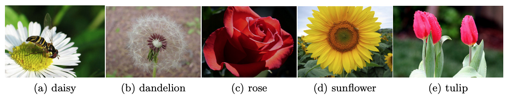

# classification-using-neural-network

## Aim
We will implement a simple single layer neural network and multilayer neural network architecture to classify flowers into 5 classses which daisy, tulip, rose, sunflower, dandelion.



This dataset contains 4242 images of flowers. The data collection is based on the data flickr, google images, yandex images.

The pictures are divided into five classes: daisy, tulip, rose, sunflower, dandelion. For each class there are about 800 photos.

### 1. Single Layer Neural Network

The architecture of this single-layer neural network has 768 inputs and 5 outputs.

I used the softmax function which is uses for the multiclass logistic regression. Softmax is kind of Multi Class Sigmoid basically getting a probability of each class. I also used cross-entropy to calculate the loss.

Let's overview of the core point of the code:

```python

def train(self):
        X = self.X
        for i in np.arange(0, self.epoch):
            epoch_loss_values = []
            
            # train the data using mini-batch
            for current_batch in np.arange(0, X.shape[0], self.batch_size):
                bX = X[current_batch:current_batch + self.batch_size]
                batch_labels = self.y[current_batch:current_batch + self.batch_size]

                outputs = self.feedforward(bX)
                
                # getting a probability of each class
                probs = self.softmax(outputs) 
                
                # calc. the loss using cross-entropy
                loss = self.cross_entropy_loss(bX, batch_labels, probs) 
                epoch_loss_values.append(loss)
                
                # minimize the loss func. using gradient descent
                self.backpropagation(bX, batch_labels, probs) 
            self.loss.append(np.mean(epoch_loss_values))

        model = [self.weights, self.b]
        np.save("slnn_model", model)
```

#### 1.1 Software Usage

* firstly, run train.py to train the model:

```python
python3 train.py -data_path path/to/data -e epoch number -a learning rate -b batch size
```
* then run test.py to calculate the results:

```python
python3 test.py -data_path path/to/data -model_path path/to/model
```

#### 1.2 Visualization of parameters


If we pay attention to the sunflower and the tulip, the model looks well trained. But the accuracy rates overlap with this situation.

#### 1.3 Analyzing the experiments and their effects

##### 1.3.1 Activation function

Different activation functions, in fact, do have different properties. I use softmax for the output layer and cross entropy as a cost function. Also I used sigmoid or tanh with squared error as a cost function. As seen from the plot, the most successful activation function was reLU for this problem.


##### 1.3.2 Epoch number effect
As the number of epochs increases, more number of times the weight are changed in the neural network and the curve goes from underfitting to optimal to overfitting curve.

_Please read the "report.ipynb" for Multi-Layer Neural Network._
